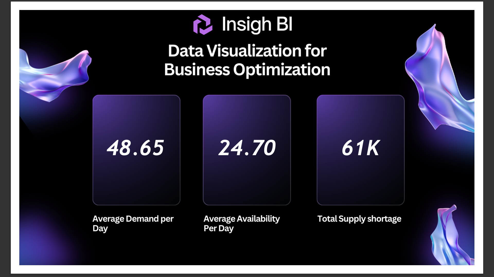
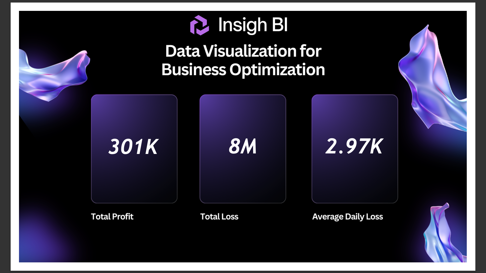

# 📊 End-to-End Inventory Analysis (SQL + MySQL + Power BI)

A complete data pipeline project demonstrating database migration, inventory optimization, and business insights using Power BI.

## 🚀 Project Highlights
- End-to-End Data Pipeline (SQL Server → MySQL → Power BI)
- Database Migration without breaking reports
- Business insights on inventory optimization


## 📌 Project Overview
This project demonstrates an end-to-end data analysis workflow where inventory data is processed, transformed, and visualized to generate business insights.

It includes:
- Data extraction and transformation using SQL
- Migration from SQL Server to MySQL
- Data modeling and visualization using Power BI

---

## ⚙️ Tech Stack
- SQL Server
- MySQL
- Power BI
- Power Query (M Language)
- DAX

---

## 🔄 Use Cases

### 1. Development → Production Pipeline
Designed a workflow where data transformations and reports were first developed in a test environment (SQL Server) and later migrated to production with minimal changes.

Ensured:
- Reusability of queries
- No breakage in Power BI reports
- Smooth transition between environments

### 2. Database Migration (SQL Server → MySQL)
Migrated the backend database from SQL Server to MySQL without rebuilding dashboards.

Key achievements:
- Recreated schema and transformations in MySQL
- Maintained consistency in KPIs and calculations
- Reconnected Power BI with minimal modifications

---

## 📊 Dashboard Preview

### 🔹 Supply & Demand Overview


### 🔹 Financial Overview


---
```
## 📁 Project Structure
End-to-End-Inventory-Analysis/
│
├── assets/
│   ├── backgrounds/
│   └── images/        
│
├── data/
├── dax/
├── powerbi/
├── sql/
├── README.md

```
---

## 📈 Dashboard KPIs
- Average Demand per Day
- Average Availability per Day
- Total Supply Shortage
- Total Profit
- Total Loss
- Average Daily Loss

---

## 📊 Business Insights

* 📉 **High supply shortage (~61K units)** indicates demand is consistently exceeding availability → potential lost revenue.
* ⚖️ **Average demand (48.65) > average availability (24.70)** shows inefficient inventory planning.
* 💸 **Total loss (~8M)** significantly outweighs profit (~301K), highlighting poor supply-demand alignment.
* 📅 Certain dates show repeated shortages → suggests need for demand forecasting or safety stock strategy.

---

## 🚀 Recommendations

* Implement **demand forecasting models** to predict future needs.
* Optimize inventory using **buffer stock / safety stock strategies**.
* Improve supply chain responsiveness to reduce daily shortages.
* Monitor high-loss products and adjust procurement strategy.

---

## ⚡ Impact

* Reduced supply shortage → increased sales
* Better stock planning → lower losses
* Data-driven decisions → improved operational efficiency


## 🧠 Key Learnings
- End-to-end data pipeline design
- Handling multiple data sources
- Database migration strategies
- Power BI data modeling and DAX optimization

---

## 📌 Future Improvements
- Implement scheduled refresh using Power BI Service
- Integrate real-time streaming data pipeline
- Enhance dashboard with forecasting visuals
